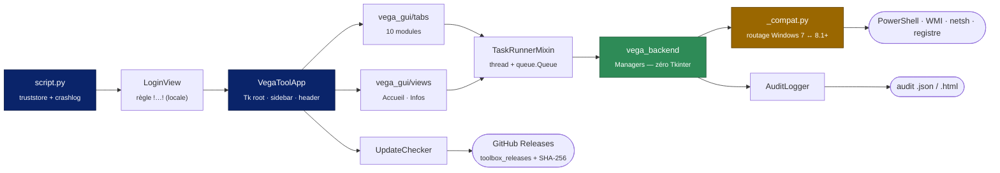
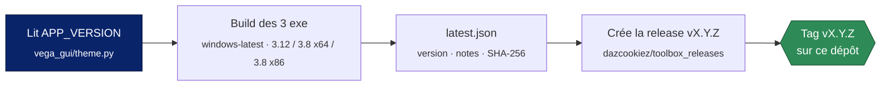

<div align="center">


# Vega Toolbox

**La boîte à outils du support VEGA6 — un seul exécutable, treize modules, zéro installation.**

<br>

[](#journal-des-versions)
[](#les-deux-builds)
[](#architecture)


<br>

[**Vue d'ensemble**](#-vue-densemble) &nbsp;·&nbsp;
[**Architecture**](#-architecture) &nbsp;·&nbsp;
[**Modules**](#-modules) &nbsp;·&nbsp;
[**Les deux builds**](#-les-deux-builds) &nbsp;·&nbsp;
[**Installation**](#-installation) &nbsp;·&nbsp;
[**Build & release**](#-build--publication) &nbsp;·&nbsp;
[**Auto-MAJ**](#-auto-mise-à-jour) &nbsp;·&nbsp;
[**Support**](#-support)

</div>

<br>

---

## 🎯 Vue d'ensemble

Vega Toolbox centralise les opérations de support et de migration VEGA6 dans une
interface unique **style Windows XP**. Conçu pour le support interne Zucchetti, il
remplace une poignée de scripts épars, de procédures Word et de manipulations
manuelles par un exécutable unique, élevé en administrateur, qui journalise tout ce
qu'il fait.

<table>
<tr>
<td width="50%" valign="top">

**🔄 Migration & données**
- Migration **VEGA5 → VEGA6** avec sauvegarde et retour arrière
- Rollback complet sur anomalie (fichier verrouillé, élément manquant)
- Moteur **HFSQL** Client/Serveur PCSoft en installation silencieuse
- Nettoyage des fichiers obsolètes de la racine Vega

</td>
<td width="50%" valign="top">

**🖧 Poste & réseau**
- Partage `\\PC\ImpressionsVega$` : création et réparation (NTFS + SMB)
- Pare-feu Windows : RetailForce (7678) et HFSQL (4900)
- Bascule **DHCP ↔ IP fixe** sur les cartes réseau
- Rapport **Info PC** + vérification de compatibilité matérielle

</td>
</tr>
<tr>
<td width="50%" valign="top">

**✉️ Diagnostic & services**
- Test **SMTP** complet, bascule **OAuth2** automatique pour Microsoft 365
- Sauvegarde **CerberIT** (Kiwi Backup) : install, planning, diagnostic
- Catalogue de téléchargements (HFSQL, VC++ redist, builds VEGA, Syspay)

</td>
<td width="50%" valign="top">

**🛠 Confort**
- Installation en un clic de **Notepad++ + JsonTools** et de **RetailForce**
- **Journal d'audit** exportable en HTML / JSON
- **Journal de crash** sur disque, même en build fenêtré
- Visite guidée en **26 étapes** intégrée

</td>
</tr>
</table>

---

## 🏗 Architecture

### Langage & frameworks

| Couche | Technologie | Rôle |
|:--|:--|:--|
| **Langage** | Python `3.12` (moderne) · `3.8` (legacy) | — |
| **Interface** | Tkinter / ttk *(stdlib)* | Thème natif `xpnative`, DPI-aware, scaling adaptatif |
| **Packaging** | PyInstaller *onefile* | `uac_admin=True`, métadonnées Windows, icône |
| **Système** | PowerShell · WMI/CIM · `winreg` · `netsh` | Scripts générés à la volée, sans fenêtre |
| **Login** | Règle locale `!…!` *(temporaire, depuis 5.0.1)* | `lib/CryptoTools.dll` n'est plus appelée par le login |
| **Réseau** | `urllib` · httpx · truststore | HTTP/2, reprise, magasin de certificats Windows |
| **Auth M365** | MSAL | Bascule OAuth2 du test SMTP |
| **Divers** | PyYAML · Pillow *(optionnel)* | `kiwi.conf` CerberIT · mise à l'échelle des logos |

> [!NOTE]
> **Ni base de données, ni serveur, ni framework web.** C'est une application de
> bureau monoposte. La persistance se limite à un JSON de préférences dans
> `%APPDATA%\VegaToolbox\`.

### Flux applicatif



### Trois règles d'or

| # | Règle | Pourquoi |
|:-:|:--|:--|
| **1** | `vega_backend` n'importe **jamais** Tkinter | Chaque module métier reste utilisable seul et testable hors interface |
| **2** | `vega_gui` ne fait **aucun** appel système direct | Il pilote les *Managers*, qui s'exécutent dans un thread et répondent par une `queue.Queue` — l'UI ne gèle jamais |
| **3** | Toute la compatibilité Windows vit dans `_compat.py` | Un seul endroit décide `Get-CimInstance` vs `Get-WmiObject`, `New-NetFirewallRule` vs `netsh`… |

<details>
<summary><b>📁 Structure complète du dépôt</b></summary>

<br>

```
toolbox/
│
├── script.py                             Point d'entrée — truststore, crashlog, lancement GUI
├── vega_security.py                      Login (règle !…!) + config %APPDATA%
├── version_info.txt                      Métadonnées Windows embarquées dans l'exe
│
├── VegaV6_Migration.spec                 Recette PyInstaller — build moderne
├── VegaV6_Migration_legacy.spec          Recette PyInstaller — build legacy (fenêtré)
├── VegaV6_Migration_legacy_console.spec  Idem avec console, pour diagnostiquer un crash au boot
│
├── requirements.txt                      Dépendances du build moderne (Python 3.12)
├── requirements-legacy.txt               Dépendances épinglées du build legacy (Python 3.8)
├── .github/workflows/build.yml           Build des 3 exe (CI) + publication des releases
├── generate_user_guide.py                Génération du .docx        ⚠ obsolète
├── set_password.py                       Vérif du format de mot de passe (règle !…!)
│
├── docs/SIGNING.md                       Signature de code (certificat auto-signé)
├── lib/                                  CryptoTools.dll · Newtonsoft.Json.dll · UCRT x86/x64
├── media/                                Logos, icônes FamFamFam Silk, .ico
│
├── vega_gui/                             ── COUCHE PRÉSENTATION ─────────────────
│   ├── app.py                            VegaToolApp : root, sidebar, cycle de vie, updater
│   ├── theme.py                          Couleurs XP, APP_VERSION, table des icônes
│   ├── resources.py                      Chargement images (compatible _MEIPASS)
│   ├── widgets.py                        ScrollableHost, Sidebar, LogDrawer, tool_button
│   ├── utils.py                          DPI, scaling adaptatif, détection petit écran
│   ├── _tutorial.py                      Overlay + spotlight + 26 étapes
│   ├── _task_runner.py                   Mixin asynchrone (thread + queue)
│   ├── _status_bar.py                    Mixin barre d'état + indicateur d'activité
│   ├── _crashlog.py                      excepthook + report_callback_exception → fichier
│   │
│   ├── tabs/                             Un module = un fichier
│   │   ├── migration.py   impressions.py   firewall.py   fixed_ip.py
│   │   ├── clean.py       smtp_test.py     download.py   pc_info.py
│   │   └── hfsql.py       cerberit.py
│   │
│   └── views/
│       ├── home.py                       Accueil : racine Vega, état du poste, raccourcis
│       ├── _home_checks.py               Les 6 contrôles critiques du tableau de bord
│       ├── login.py                      Écran de connexion
│       └── support.py                    Infos / support + vérification MAJ manuelle
│
└── vega_backend/                         ── COUCHE MÉTIER (sans Tkinter) ────────
    ├── _common.py                        Helpers, ToolLogger, catalogue, lecture registre
    ├── _compat.py                        Routage Windows 7 ↔ Windows 8.1+
    ├── _download_core.py                 Moteur de téléchargement (httpx, reprise, ETA)
    │
    ├── migration.py                      Pipeline migration + sauvegarde + rollback
    ├── impressions.py                    Création / réparation partage SMB
    ├── firewall.py                       Règles pare-feu RetailForce + HFSQL
    ├── fixed_ip.py                       Bascule DHCP / IP fixe
    ├── clean.py                          Analyse + déplacement fichiers obsolètes
    ├── smtp.py                           Test SMTP + bascule OAuth2 (MSAL)
    ├── downloads.py                      Catalogue + découverte de l'index VEGA6 distant
    ├── notepad.py                        Notepad++ + plugin JsonTools
    ├── retailforce.py                    Désinstall + install + mise à jour RetailForce
    ├── pc_info.py                        Collecte matérielle / logicielle
    ├── compatibility.py                  Prérequis matériels Vega (dont détection SSD)
    ├── hfsql_installer.py                Moteur HFSQL PCSoft : install / MAJ / désinstall
    ├── cerberit.py                       CerberIT : install /S, register, kiwi.conf, diagnostic
    ├── audit.py                          Journal d'audit (export HTML / JSON)
    ├── updater.py                        Auto-MAJ via GitHub Releases (+ SHA-256)
    └── defender.py                       Exclusion Windows Defender pour les _MEI*
```

</details>

---

## 🧩 Modules

### Accueil — tableau de bord

| Section | Rôle |
|:--|:--|
| **Racine Vega détectée** | Auto-détection du dossier d'installation, partagée entre tous les modules |
| **État du poste** | Synthèse des 6 contrôles critiques — admin, pare-feu, partage, structure, HFSQL, JSON RetailForce. Le bouton **Bases** se dégrise après « Tout vérifier » et cible une base pour tout l'outil |
| **Démarrage rapide** | Quatre raccourcis directs : Migration · Téléchargement · Nettoyage · IP fixe |
| **Outils complémentaires** | Installer Notepad++ + JsonTools · Installer RetailForce · Mettre à jour RetailForce |

### Modules métier

| | Module | Description |
|:-:|:--|:--|
| 🔄 | **Migration** | Vérification des prérequis, migration VEGA5 → VEGA6 avec sauvegarde, retour arrière, pilotage du service HFSQL, sélection de base (**Bases ▾**). Sur anomalie — fichier verrouillé ou élément manquant — une popup propose de continuer, d'ignorer les suivants, ou de **tout annuler** (rollback complet) |
| 🖨 | **Impressions Vega** | Vérifie et répare `C:\ImpressionsVega` et le partage `ImpressionsVega$`, côté NTFS **et** SMB |
| 🛡 | **Pare-feu** | Règles `Service Fiscal RetailForce` (TCP 7678) et `HFSQL Server` (TCP 4900), avec lecture directe du registre |
| 🌐 | **IP fixe** | Bascule une carte réseau de DHCP vers IP fixe **en conservant l'adresse courante** |
| 🧹 | **Nettoyage Vega** | Range les fichiers obsolètes de la racine dans `vega.dos` : anciennes DLL/exe, PDF, archives, copies, images, FDJ. Sélection de base (**Bases ▾**) |
| ✉️ | **Envoi mail** | Test SMTP avec **auto-bascule OAuth2** si le MFA est refusé par Microsoft 365 |
| ⬇️ | **Téléchargement** | Catalogue intégré (HFSQL Client/Server, Visual C++ redist, Syspay) **+** découverte en direct des index VEGA6 **PROD** et **BETA** distants |
| 🗄 | **HFSQL Serveur** | Installe, met à jour ou réinstalle le moteur HFSQL Client/Serveur PCSoft en silencieux. Bouton **Vérifier** (présence du moteur) et **Bases ▾** (répertoire serveur) |
| 💻 | **Info PC** | Instantané matériel + logiciel façon CPU-Z, moniteur temps réel, **vérification de compatibilité Vega** (détection SSD fiable, y compris en VM) et export d'un rapport HTML |
| 🥝 | **CerberIT** | Sauvegarde CerberIT / Kiwi Backup : enregistrement par clé de contrat, **sélection visuelle** des disques et dossiers, exclusions, planning, sauvegarde manuelle, **diagnostic** (service, port 4443, journal) et désinstallation en cascade |

---

## 🪟 Les deux builds

Deux saveurs, **un seul code source**. `vega_backend/_compat.py` lit la version de
Windows dans le registre — et non via `sys.getwindowsversion()`, qui plafonne à 6.2
sans manifeste — puis route vers les commandes adaptées.

| Binaire | Cible | Interpréteur |
|:--|:--|:-:|
| **`vega_toolbox.exe`** | Windows 8.1+ / Server 2012 R2+ | `3.12` |
| **`vega_toolbox_legacy_x64.exe`** | Windows 7 SP1 / Server 2008 R2 → Windows 8 / Server 2012 — **64 bits** | `3.8` |
| **`vega_toolbox_legacy_x86.exe`** | idem — **32 bits**, tourne aussi sous WOW64 | `3.8` |

Les postes ≤ 6.1 n'ont ni PowerShell 3.0, ni les modules `Net*` / `Smb*` / `Storage`.
Le build legacy retombe donc sur les équivalents historiques — qui existent **encore**
sur les Windows récents, ce qui rend ces chemins testables partout :

<div align="center">

| Fonction | Windows 8.1+ | Windows 7 |
|:--|:--|:--|
| Inventaire matériel | `Get-CimInstance` | `Get-WmiObject` |
| Sérialisation JSON | `ConvertTo-Json` | sérialiseur .NET 3.5 |
| Règles pare-feu | `New-NetFirewallRule` | `netsh advfirewall` |
| Partage SMB | `New-SmbShare` | `net share` + `Win32_Share` |
| Ports en écoute | `Get-NetTCPConnection` | `netstat -ano` |

</div>

Le build legacy **embarque l'Universal C Runtime** — 44 DLL du SDK Windows déployées
en *app-local* depuis `lib/ucrt/<arch>`. Le correctif KB2999226 n'est donc pas requis.
Le spec ne les embarque que si le jeu est **complet** : un jeu partiel casserait aussi
les postes déjà à jour.

> [!IMPORTANT]
> **Aucun prérequis sur un Windows 7 nu depuis la 5.0.1.** Jusqu'à la 5.0.0, l'écran de
> connexion reposait sur `CryptoTools.dll` et exigeait le .NET Framework 4.x ; la règle
> locale `!…!` ne charge plus `clr`. Si `CryptoTools.dll` revient, ce prérequis — et la
> vérification du registre **avant** d'importer `clr` (assemblage mixte, crash fatal
> sous CLR 2.0 seul) — reviennent avec elle.

---

## 📦 Installation

### Pour les utilisateurs

Téléchargez le binaire correspondant au poste et lancez-le. L'application demande une
élévation administrateur (UAC) : la plupart des modules l'exigent.

> [!NOTE]
> À la première exécution, l'application ajoute une exclusion Windows Defender sur ses
> fichiers temporaires d'extraction (`%TEMP%\_MEI*`). Elle neutralise le faux-positif
> `Failed to load Python DLL` qui apparaissait pendant les auto-mises à jour.

### Pour les développeurs

```bash
git clone https://github.com/dazcookiez/toolbox.git
cd toolbox
pip install -r requirements.txt
python script.py
```

Un profil de debug VS Code est fourni : **Vega Toolbox (sources)** dans `.vscode/launch.json`.

En mode source, le login fonctionne normalement, mais l'auto-mise à jour est
désactivée : elle exige `sys.frozen`.

---

## 🔨 Build & publication

### Build moderne — Python 3.12

```bash
python -m PyInstaller VegaV6_Migration.spec --noconfirm --clean
```

→ `dist/vega_toolbox.exe` (~26 Mo). Embarque tkinter, images, icônes, MSAL,
truststore, PyYAML et tous les modules métier. **Le nom `vega_toolbox.exe` est fixe** :
l'auto-mise à jour en dépend.

### Build legacy — Python 3.8, x86 **et** x64

```bash
pip install -r requirements-legacy.txt
python -m PyInstaller VegaV6_Migration_legacy.spec --noconfirm --clean
```

Deux environnements dédiés sont attendus — `.venv-legacy-x86` et `.venv-legacy-x64`,
tous deux gitignorés. **Le nom de sortie suit l'architecture de l'interpréteur qui
exécute PyInstaller**, ce n'est pas un paramètre.

<details>
<summary><b>Pourquoi ces versions sont épinglées</b></summary>

<br>

| Épingle | Raison |
|:--|:--|
| `pythonnet==2.5.2` | Sa `Python.Runtime.dll` cible .NET Framework 4.0 au lieu de netstandard2.0 → abaisse le prérequis de l'écran de connexion de .NET 4.6.1+ à **.NET 4.0**, disponible sur tous les Windows visés. `clr_loader` n'existe qu'en pythonnet 3.x et n'est donc pas déclaré en `hiddenimports` |
| `pyinstaller==5.13.2` | Dernière version compatible. Le paramètre `optimize` de l'`Analysis` n'apparaît qu'en PyInstaller 6.x : il est volontairement absent du spec legacy |
| *pas de* `truststore` | Requiert Python 3.10+. Sans lui, `ssl` retombe sur le magasin de certificats Windows — ce qui reste correct sur ces OS |

</details>

En cas de crash au démarrage sur un poste ancien, `VegaV6_Migration_legacy_console.spec`
produit `vega_toolbox_legacy_<arch>_console.exe` : même bundle, console visible.

### Signature

Voir **[`docs/SIGNING.md`](docs/SIGNING.md)** — certificat auto-signé, `signtool`,
horodatage, et déploiement du `.cer` sur les postes clients.

### Publier une release

Les trois exécutables sont construits par **GitHub Actions**
([`.github/workflows/build.yml`](.github/workflows/build.yml)) à chaque pull request et
à chaque push sur `main`. Pour publier :

1. Bumper `APP_VERSION` et `version_info.txt`, ajouter la ligne du journal des versions, merger sur `main`.
2. Onglet **Actions** → **Build** → **Run workflow** sur `main`, cocher **publish**, saisir les notes de version.



Si la release existe déjà, le workflow s'arrête sans rien écraser : il faut bumper la
version d'abord. Le build vérifie aussi que `theme.py` et `version_info.txt` portent la
même version.

> [!NOTE]
> Le code source est **privé** ; les binaires sont publiés dans le dépôt **public**
> [`dazcookiez/toolbox_releases`](https://github.com/dazcookiez/toolbox_releases/releases),
> le seul que les postes interrogent. Prérequis (une fois) : le secret `RELEASES_TOKEN`
> de ce dépôt, un jeton *fine-grained* avec **Contents: Read and write** sur
> `toolbox_releases`.

### Versioning

Format `X.Y.Z`, pas SemVer strict :

<div align="center">

| | Signification |
|:-:|:--|
| **X** | Refonte majeure |
| **Y** | Nouvelle fonctionnalité ou groupe de correctifs |
| **Z** | Correctif mineur |

</div>

> [!WARNING]
> La version vit à **deux endroits qui doivent rester synchronisés** :
> `vega_gui/theme.py` (`APP_VERSION` — source de vérité pour l'updater et la release)
> et `version_info.txt` (métadonnées Windows de l'exe).

---

## 🔄 Auto-mise à jour

Trois secondes après l'ouverture, Vega Toolbox lit le manifeste de la dernière release
du dépôt public des binaires :

```http
GET https://github.com/dazcookiez/toolbox_releases/releases/latest/download/latest.json
```

```json
{ "version": "5.0.2", "notes": "…", "sha256": { "vega_toolbox.exe": "…", "vega_toolbox_legacy_x64.exe": "…", "vega_toolbox_legacy_x86.exe": "…" } }
```

`version` donne la version distante, puis l'outil télécharge depuis la release
`vX.Y.Z` **le nom exact correspondant à sa propre saveur** :

<div align="center">

| Saveur — `_compat.build_flavor()` | Asset attendu |
|:--|:--|
| `modern` | `vega_toolbox.exe` |
| `legacy_x64` | `vega_toolbox_legacy_x64.exe` |
| `legacy_x86` | `vega_toolbox_legacy_x86.exe` |

</div>

> [!CAUTION]
> La correspondance est **exacte, sans repli**. Un poste Windows 7 qui téléchargerait
> le binaire moderne ne redémarrerait plus jamais. La saveur est déduite de
> `sys.version_info < (3, 9)` : infalsifiable, et aucune plomberie PyInstaller à
> maintenir.

> [!IMPORTANT]
> L'exe téléchargé n'est appliqué que si son **SHA-256** correspond à celui publié dans
> `latest.json`. Les postes encore en 5.0.0 / 5.0.1 interrogent l'ancien GitLab : ils
> doivent être passés **une fois** manuellement en 5.0.2.

<details>
<summary><b>Le pipeline d'application, étape par étape</b></summary>

<br>

1. **Téléchargement** de l'asset dans `%TEMP%\vega_toolbox_update.exe` — rejeté si < 1 Mo ou si son SHA-256 diffère de `latest.json`.
2. **Écriture et lancement détaché d'un batch**, puis `os._exit(0)` immédiat du
   processus courant : sans finalisation Python, pour que le bootloader PyInstaller ne
   survive pas au remplacement de l'exe sous lui — c'était la cause du popup
   `Failed to load python312.dll` en post-update.
3. **Le batch** attend, `taskkill /f`, déplace le nouveau binaire avec retry, force une
   lecture complète (`type`) pour finaliser le scan Defender, relance l'application,
   puis s'auto-supprime.

Deux garde-fous : la mise à jour est réservée aux builds compilés (`sys.frozen`), et
les exécutables nommés `*_dev.exe` sont exclus du check silencieux — pas question qu'un
testeur soit downgradé vers la prod. Le bouton **Vérifier les mises à jour** de l'écran
Infos force un check qui, lui, répond toujours.

</details>

---

## 🎓 Mode Tutoriel

Un bouton **Tutoriel** dans l'en-tête lance une visite guidée en **26 étapes** :
overlay sombre semi-transparent, spotlight jaune autour du widget pertinent, callout
style XP avec navigation *Précédent / Suivant / Quitter*. Le tutoriel change
automatiquement de module pour présenter chaque écran et chacun de ses boutons.

<kbd>Échap</kbd> quitte à tout moment. La visite suit le déplacement et le
redimensionnement de la fenêtre.

---

## ⌨️ Raccourcis clavier

<div align="center">

| Raccourci | Action |
|:-:|:--|
| <kbd>F1</kbd> | Écran Infos / support |
| <kbd>F5</kbd> | Rafraîchit le module courant |
| <kbd>F12</kbd> | Maximise / restaure la fenêtre |
| <kbd>Ctrl</kbd>+<kbd>L</kbd> | Déplie / replie le tiroir journal |
| <kbd>Ctrl</kbd>+<kbd>1</kbd> … <kbd>9</kbd> | Accueil · Migration · Impressions · Pare-feu · IP fixe · Nettoyage · Envoi mail · Téléchargement · Info PC |
| <kbd>Échap</kbd> | Ferme une boîte de dialogue ou le tutoriel |

</div>

> [!NOTE]
> **HFSQL Serveur** et **CerberIT** n'ont volontairement pas de raccourci : seuls les
> chiffres 1 à 9 existent comme keysym Tk. `<Control-Key-10>` lève un `TclError` que le
> Tk livré avec Python 3.8 refuse de tolérer — l'application plantait juste après le
> login sur le build legacy.

---

## 📐 Conventions

### Logging

Tous les modules écrivent via `ToolLogger`, thread-safe. Les messages sont consommés
par le thread Tk via une `queue.Queue`, affichés dans le tiroir journal, et **chaque
ligne est répliquée dans le journal d'audit** (`info` → *info*, `warn` → *warning*,
`error` → *failure*).

```python
self.logger.info("Action démarrée")
self.logger.warn("Cas de bord détecté")
self.logger.error("Échec de l'opération")
```

### Fichiers écrits sur le poste

| Chemin | Contenu |
|:--|:--|
| `%APPDATA%\VegaToolbox\vega_tool_config.json` | Préférences : dernière racine Vega, géométrie de fenêtre, mode d'écran, `skip_login_once` |
| `<racine Vega>\vega_toolbox_audit.{json,html}` | Journal d'audit des actions |
| `<dossier de l'exe>\vega_toolbox_crash.log` *(sinon `%TEMP%`)* | Traces des exceptions non rattrapées |

> [!IMPORTANT]
> **Aucun mot de passe n'est stocké.** Depuis la 5.0.1, le login accepte toute saisie
> encadrée par `!` d'au moins 4 caractères (règle temporaire) ; `CryptoTools.dll` n'est
> plus appelée.

### État de l'outillage

| Script | État |
|:--|:--|
| `.github/workflows/build.yml` | ✅ **À jour** — build CI + pipeline de release officiel (remplace `publish_release.py`, GitLab) |
| `generate_user_guide.py` | ⚠️ **Obsolète** — lit `vega_gui.py`, fichier disparu lors du passage au package `vega_gui/`. `Procedure_Outil_Migration_VEGA6.docx` est donc figé |
| `set_password.py` | ✅ Cohérent avec la règle `!…!` de la 5.0.1 |

---

## 🪪 Métadonnées Windows

<div align="center">

| Champ | Valeur |
|:--|:--|
| Description du fichier | `vega toolbox` |
| Société | `Zucchetti` |
| Nom du produit | `Vega Toolbox` |
| Version du fichier | `5.0.2.0` |
| Version du produit | `5.0.2` |
| Copyright | `© Zucchetti` |
| Langue | `Français (France)` |
| Nom de fichier original | `vega_toolbox.exe` |

</div>

---

## 📜 Journal des versions

| Version | Faits marquants |
|:-:|:--|
| **5.0.2** | **Téléchargement** : nouveau canal **VEGA6 BETA** (`VEGA6/PROD/BETA/`) listé à côté de PROD, extraction automatique dans `vega.dos\V6`. **Reprise du projet sur GitHub** : auto-mise à jour via GitHub Releases avec vérification SHA-256, nom d'exe fixe `vega_toolbox.exe` rétabli, build et publication des 3 binaires par GitHub Actions. Contact support : Cristian. *Postes en 5.0.0 / 5.0.1 : mise à jour manuelle unique* |
| **5.0.1** | **RetailForce** 1.11.2 → 1.11.21.7255 (x64 + x86). **Login** : règle locale `!…!` (≥ 4 caractères) à la place de `CryptoTools.dll` — temporaire |
| **5.0.0** | **Support Windows 7 SP1 → Server 2012** : second binaire x86/x64 en Python 3.8, couche de compatibilité, UCRT embarqué, canal de mise à jour dédié. Détection automatique d'architecture pour Notepad++/JsonTools et RetailForce. Désinstallation CerberIT en cascade. Journal de crash. *Correctifs :* ports HFSQL, raccourcis clavier invalides, détection HFSQL 32 bits |
| **4.0.8** | Nouveau module **CerberIT** (Kiwi Backup) : installation silencieuse, enregistrement par clé de contrat, sélection visuelle des dossiers, planning, diagnostic, désinstallation. Test SMTP plus réactif — timeout 30 s → 10 s |
| **4.0.7** | Mise à jour du tutoriel guidé (26 étapes) et du README |
| **4.0.6** | Correctif détection JSON RetailForce : une apiKey de test ne marque plus « à réinitialiser » un vrai client |
| **4.0.5** | Boutons **Bases** (Accueil / Migration / Nettoyage / HFSQL), bouton **Vérifier** HFSQL, détection SSD fiable en VM, gestion des anomalies de migration avec rollback, bouton **Mettre à jour RetailForce** |

---

## 🆘 Support

<div align="center">

En cas de problème, contactez :

**Cristian** *— mainteneur* — [info@microc.fr](mailto:info@microc.fr)

<sub>Auteur d'origine : Bastien Tillier (jusqu'à la 5.0.0, [GitLab](https://gitlab.com/Gryvernn/Vega-Migration-tool))</sub>

L'écran **Infos** de l'application contient les coordonnées détaillées
et un bouton de contact direct.

<br><br>


<sub>© Zucchetti — Outil interne. Distribution publique non prévue.</sub><br>
<sub>Icônes : <a href="media/icons/LICENSE_FAMFAMFAM_SILK.md">FamFamFam Silk</a> — CC BY 2.5</sub>

</div>
